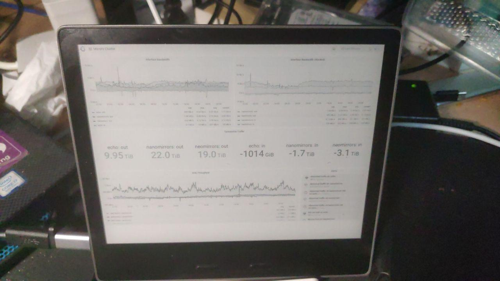

# kindle

将 kindle 作为副屏



## 前言

最近又开始摸鱼。很久以前有个通知中心的想法（目前这个想法在另一个项目中实现），主要是我注意到我拥有的屏幕并不少（手机平板小电脑Kindle），那么怎么显示这些通知呢；在想这个想法的时候，突然发现，我的 Kindle 还没法自由掌控呢，于是我开始折腾。

然后有幸越狱（最近刚出了一个利用方式，影响范围还很广，很久没开机的 Kindle 可能都可以利用），有幸拿到 ssh（指中途被自动更新打断差点吓死），有幸摸清了一些服务，有幸找到网络上一系列 **边边角角** 的技术讨论，结合自己一些 Linux 使用经验，整理了以下路径。

## kindle 越狱/ssh

这个参考 <https://bookfere.com/post/tag/kindle%E8%B6%8A%E7%8B%B1> 即可。

做完这步之后，你能熟练地通过 usb 来 ssh 上你的机器。通过 wifi 的方式需要在更改 iptables 之后做到（清华校园网特性）

我的体验就几点

* 在拿出吃灰的 Kindle 查看固件时以及走流程之后直到 Hotfix，都要开启飞行模式！不然自动更新了都没法哭；
* 我在 Hotfix 并装了几个插件后，立即被自动更新了，KUAL 就打开失败了，然后只能重装了一次插件（应该是自动更新覆盖了一些文件）；
* 要装这个插件：usbnet。首先要使它开机自启「Enable SSH at boot」，这很重要！这是我们之后长期的调试方式！注意到 KUAL 中 usbnet 的「Toggle USBNetwork 」，这个是用来切换模式，USBMS 和 USBNET，前者就是插上以后能挂载盘（USB Mass Storage），后者插上去以后 `ip l` 多出一个新的 interface（具体名称请自己替换），然后可以这样访问机器
```console
ip l set enp0s20f0u2 up
ip a a 192.168.15.1/24 dev enp0s20f0u2
ssh root@192.168.15.244
```
* 这种模式切换是跨启动的，所以说在切换了一次以后，查询一下状态，之后便不用调整了；不过建议多切换一下模式，体验程序的工作方式
* KUAL USBNET 中显示的状态是当前的状态，而不是点击以后进入的状态
* 此时先不要开换用 openssh，继续使用 dropbear，等到换了端口以后再换服务器
* 装一个禁止休眠的 helper，在休眠后 usb网卡会掉线，从而 ssh 掉线

然后一些评论：

* 网上有说弹出但不物理拔出 Kindle 来启动 usbnet 的方法，这个方法在 Linux 下似乎不是很好操作
* 有很多同学热衷于装很多插件，但实际上在 kindle 自己的服务框架内跑服务，是非常吃内存的，在 kindle 完全开机后，我只剩余100M以下的内存，但在关掉 kindle 自己的框架以后，我能剩余接近 300M 的内存。举个例子，自定义屏保插件在每次屏保时会消耗 30~80M 的内存，还不会自动 GC（当时我拿着 `top` 监控，就怕 oom 了）
* 作为 Linux 用户，我们的最终目的就是要干掉 Kindle 的主服务，然后跑自己的服务。网上有一些 chroot 装 Arch Linux/Debian 的帖子，我为内存而担心啊。
* 不过我们不要完全抛弃 Kindle 的主服务，比如其提供的亮度调整，Wifi 连接，还是能帮助我们很多的。
* 经过探索，发现这个内核不支持 IPv6，也不支持 tun/tap ，对于不能进入我的内网，我表示遗憾。

## 调整 IP 桌子

注意到 `/etc/upstart/network.conf` 中有 `iptables-restore < /etc/sysconfig/iptables`，我们查看文件可见几个关键规则

```
*filter
:INPUT DROP [0:0]
:FORWARD ACCEPT [0:0]
:OUTPUT ACCEPT [0:0]

# TCP handling. Allow incoming TCP TPH on WAN
-A INPUT -i wlan0 -p tcp -m state --state RELATED,ESTABLISHED -j ACCEPT

# Usbnet. All traffic allowed.
-A INPUT -i usb0 -j ACCEPT

# ICMP. Allow only responses to local connections
-A INPUT -p icmp -m state --state RELATED,ESTABLISHED -j ACCEPT

COMMIT
```

我们需要调整一些规则，比如放行我的 ssh 端口（usbnet 这个插件在启动时会自己加规则，所以不需要给 22 加规则），比如放行 icmp。注意，在调整前建议备份。

```
-A INPUT -i wlan0 -p tcp -m tcp --dport <my_ssh_port> -j ACCEPT
-A INPUT -p icmp -j ACCEPT
```

## 更改 ssh 端口

重启或手动调整 iptables 规则，确保这时候我们的桌子是正确的。

这时候修改 `/mnt/us/usbnet/etc/sshd_config` （该配置不影响 dropbear） 中的端口为 `<my_ssh_port>`，然后在命令行中手动启动 `/usr/sbin/sshd` ，尝试是否能连接，如果能连接，则在 KUAL USBNET 中将默认启用的 ssh 设置为 openssh。

调整后建议重启以验证并再次尝试 ssh，确保服务如预期进行。

## DDNS

创建 `/etc/upstart/ddns` 的脚本（记得 `chmod +x`）（或者可以放在其他位置，比如 `/usr/local/bin/`，但不能放在 `/tmp/root` 中），内容为你的 DDNS 提供商的脚本，之后在 `/etc/crontab/root` 创建 `*/5 * * * * /etc/upstart/ddns` 的项目。

建议先手动运行相关脚本，测试脚本的正确性。

## swapfile

由于内存捉急，我开了一个 swapfile。注意，该文件不能在根 `/` 下！根下空间不多。

```console
dd if=/dev/zero of=/mnt/base-us/swapfile bs=1M count=200
mkswap /mnt/base-us/swapfile
swapon /mnt/base-us/swapfile
```

然后在 `/etc/fstab` 的最后加上

```
/mnt/base-us/swapfile none swap defaults 0 0
```

但是观测发现 Kindle 并不会自己挂载 swap，所以我们需要一个 helper 在开机后执行 `swapon -a`，这个参考 `zhelper` 文件夹（还没写）。安装方法就是将 `zhelper` 目录放在 `/mnt/base-us/extensions` 目录下。

## 副屏

这个的主要灵感是 <https://github.com/mpetroff/kindle-weather-display/blob/master/kindle/display-weather.sh>，发现了其中有展示图片的方法。

目前的架构是，Kindle的主服务框架依然开机自启，以便我们进行必要的调整（比如连接 Wifi，调整亮度），我们在 KUAL 中通过 Helper 启用该模式（会关闭电源管理），而这个文件的更新是通过**服务器 scp 到 Kindle**上实现的 （约定位置为 `/tmp/screen.png`），并触发相关渲染任务（当然也可以 Kindle 轮询实现，请 PR）。由于主服务未关，我们可以随时切换到主服务中进行调整。

这样在 Kindle 闲置时能自动 **播放** 屏保，非常有意思（不过也相对耗电了）

当然我们也提供了关闭主服务(Close Framework)的方法，如果想要在重启主服务，需要重启或 `ssh kindle initctl start framework`。

该服务的安装方法是将 `screen/extensions/screen` 文件夹放在 `/mnt/us/extensions` 文件夹下；将 `screen/screen` 文件夹放在 `/mnt/us/` 文件夹下。

由于图片的收集和渲染是服务端实现的，我们只需要保证传输到 Kindle 上的格式符合[其需求](https://www.mobileread.com/forums/showthread.php?t=276225)，我们提供了一个帮助脚本 `scripts/png8.sh` ，方便转换图片。需要自行修改脚本中的分辨率。

同时提个了一个样例部署脚本 `scripts/server.sh`。

## 杂项

* 在翻 `/etc/network/interfaces` 发现 `bnep0`，注意到被闲置的蓝牙
* `/var/log/messages` 是整个系统启动的 log，可以用这个查看 Kindle 的服务启动顺序。
* 服务的错误信息都在 `/tmp/some\_app.err` 中
* 类似于 `systemctl`，Kindle 有 `initctl`

## 未来可能的方向

* 安装 Debian/Arch Linux
* 更换内核，开启 IPv6 / TUNTAP 的支持
* 给 Kindle 上蓝牙组网
